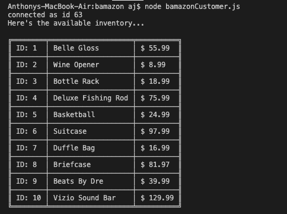
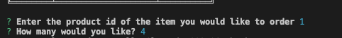
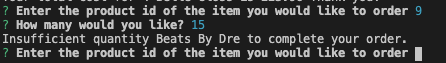
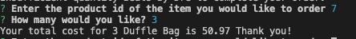

# bamazon

Bamazon is Amazon-like storefront with the MySQL. The app will take in orders from customers and deplete stock from the store's inventory. 

Packages Installed:
MYSQL - This is a node.js driver for mysql. It is written in JavaScript, does not require compiling, and is 100% MIT licensed.

Inquirer - An interactive command-line tool that can prompt users 

Table - Produces a string that represents array data in a text table.

Npm, www.npmjs.com/.

--------------------------------------------------------------------------------------------------------------------------------------------------

How it works

-First the you need to run 'node bamazonCustomer.js' from your terminal to display the available inventory.

-Next after you have had time to review the inventory, the user will be prompted to enter the ID of the desired item followed by another prompt for the quantity.

-If the order amount is more than what is currently in inventory, the user will be notified of an 'Insufficient quantity' and the order will reset prompting the user to enter the ID and a valid quantity.

-When a user completes the order process successfully, they will be prompted with the order total.

